# <center style="background-color:tomato;">**Writing & Presentation Week 1**

## **Unix Comand Line**<hr>

- ### **Command Line Interface (CLI)** 
  <div align="justify">Command Line Interface adalah sebuah metode yang digunakan user dalam menginput sebuah perintah(command) yang digunakan untuk menjalankan program, mengelola file komputer, dan berinteraksi dengan komputer.

- ### **Shell**
  <div align="justify">Shell adalah program (penterjemah perintah) yang menjembatani user dengan sistem operasi. Dimana user akan mengetikkan perintah kemudian perintah tersebut akan diteruskan ke system untuk dieksekusi.

- ### **Terminal**
  <div align="justify">Terminal adalah interface di mana Anda bisa mengetikkan baris-baris perintah berbasis teks untuk sistem operasi Linux. Biasanya, sebutan lain terminal adalah Shell. Terminal pada Linux memiliki fungsi yang mirip dengan CMD (Command Prompt).
  <br>Contoh gambar :<br>
  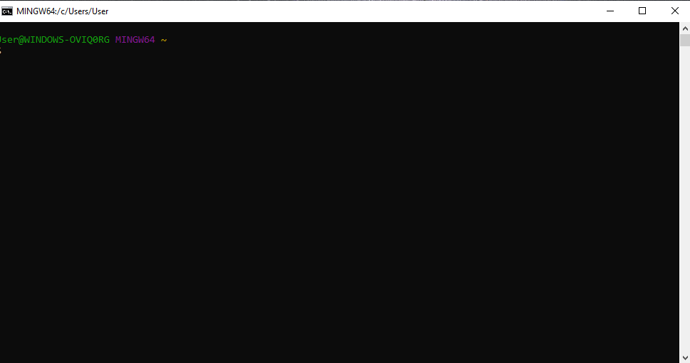

- ### **Struktur File System**
  <div align="justify">Sebuah filesystem mengatur bagaimana data disimpan di dalam sebuah system
  . Sistem operasi di Windows & Unix-like menyusun file dan direktori menggunakan struktur yang bentuknya mirip tree
  <br>Contoh gambar :<br>
  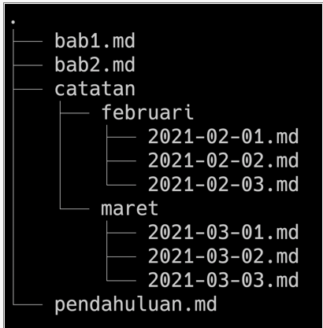

- ### **Command**
  - Command “pwd” (print working directory) untuk  melihat nama direktori kita berada saat ini.
  - Command “ls” (lists) untuk melihat isi dari direktori
  - Command “cd”  (change directory) untuk pindah ke
  direktori lain
  - Command “head”, “tail”, dan “cat” untuk isi files di awal, akhir, dan keseluruhan.
  - Command “touch” untuk membuat file
  - Command “mkdir”  untuk membuat directory
  - Command “cp” untuk menyalin file, “cp -R” untuk menyalin directory
  - Command “mv” untuk memindahkan file, “mv -R” untuk memindahkan directory
  - Command “rm” untuk menghapus file, “rm -R” atau “rm -d” untuk menghapus directory


## **Git & Github Dasar**<hr>

- ### **Pengertian Git & Github**
  - #### **Git**
    <div align="justify">Git adalah aplikasi yang digunakan untuk melacak setiap perubahan yang terjadi pada suatu folder atau file. Git biasanya digunakan oleh para programmer sebagai tempat penyimpanan file pemrograman mereka, karena lebih efektif. File -file yg disimpan menggunakan git akan terlacak seluruh perubahannya, termasuk siapa yang mengubah.

  - #### **Github**
    <div align="justify">GitHub merupakan layanan cloud berbasis website yang berguna untuk menyimpan dan mengelola sebuah project menggunakan repository (repo git). 

- ### **Mengapa harus menggunakan GIT dan Github?**
  <div align="justify">Dengan menggunakan GIT dan Github, tujuannya yaitu untuk memudahkan programmer dalam melakukan kolaborasi mengerjakan proyek yang sama tanpa harus repot copy paste folder aplikasi yang terupdate. kita juga tidak perlu menunggu rekan dalam satu tim menyelesaikan suatu program dahulu untuk berkolaborasi. karena kita dapat membuat file didalam projek yang sama atau membuat code di file yang sama dan menyatukannya saat sudah selesai.

- ### **Perintah menggunakan git & github**
  - #### **git config**
    Perintah git yang digunakan untuk mengatur konfigurasi.
    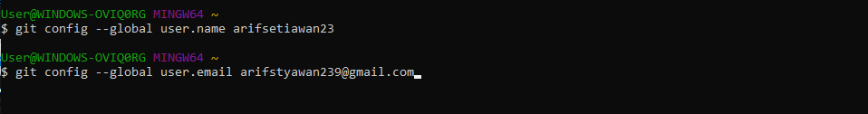
    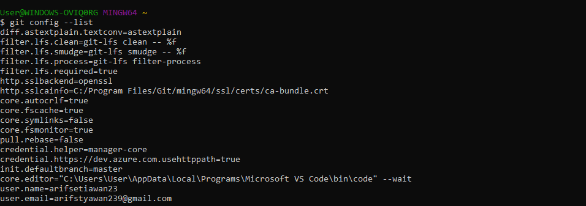
  - #### **git init**
    Perintah ini digunakan untuk membuat repositori baru.
    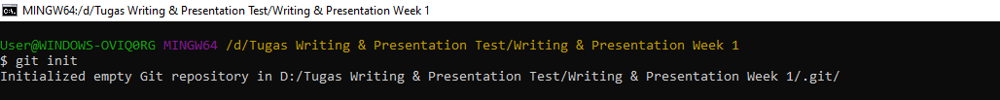
  - #### **git status**
    Perintah git status menampilkan daftar file yang berubah bersama dengan file yang ingin di tambahkan.
    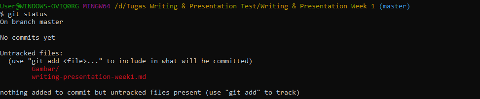
  - #### **git add**
    Perintah git add bisa digunakan untuk menambahkan file.
    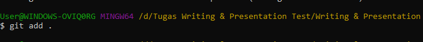
  - #### **git commit**
    Perintah git commit digunakan untuk melakukan commit atau menyimpan perubahan pada version control pada git.
    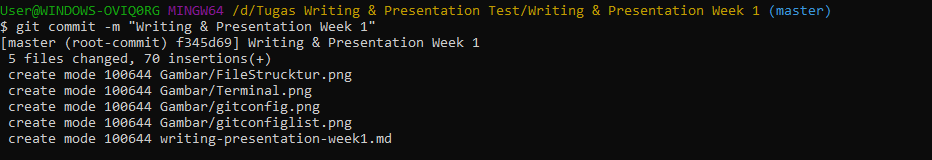
  - #### **git remote**
    Perintah git remote akan membuat user terhubung ke remote repository.
    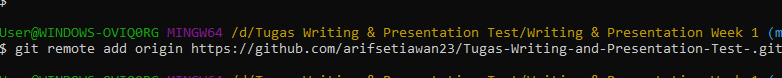
  - #### **git push**
    git push adalah perintah untuk mengirimkan perubahan ke master branch dari remote repository.
    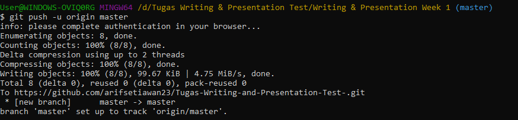

## **Html**<hr>
- ### **Pengertian & Fungsi Html**
  <div align="justify">HTML (Hypertext Markup Language) adalah bahasa markup yang digunakan untuk membuat halaman website. Isinya terdiri dari berbagai kode yang dapat menyusun struktur suatu website. HTML sendiri digunakan untuk menampilkan konten pada browser. Contoh konten yang dapat ditampilkan seperti Text, Image, Video, Link, dan masih banyak lainnya.
- ### **Tools Yang Diperlukan Membuat Html**
  - #### **Browser**
    <div align="justify">Ada banyak Browser yang bisa digunakan. Paling recommended bisa menggunakan Google Crome.
  - #### **Code Editor**
    <div align="justify">Direkomendasikan menggunakan Visual Studio Code karena bisa digunakan untuk banyak bahasa pemrograman dan banyak extension yang tersedia.
  - #### **Extension Visual Studio Code**
    - **Live Server**
      <div align="justify">Live server merupakan extensi yang dapat secara otomatis menampilkan perubahan web ketika kita melakukan perubahan pada code html atau pun css.
    - **Prettier**
      <div align="justify">prettier dapat secara otomatis merapikan dan memformat kode sehingga mudah untuk dibaca dan terlihat rapi.
    - **Auto Rename Tag**
      <div align="justify">Auto Rename Tag akan secara otomatis  menganti tag apabila salah satu tag pembuka atau tag penutup diubah.
    - **Auto Close Tag**
      <div align="justify">Ekstensi untuk menambahkan penutup tag secara otomatis pada HTML.
- ### **Struktur Html**
  ```html
  <!DOCTYPE html>
  <html lang="en">
  <head>
      <meta charset="UTF-8">
      <meta http-equiv="X-UA-Compatible" content="IE=edge">
      <meta name="viewport" content="width=A, initial-scale=1.0">
      <title>Belajar Html</title>
  </head>
  <body>
      Ayo belajar Html di Skivul
  </body>
  </html>
  ```
- ### **Html Anotomy**
  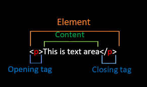

  - HTML Element adalah semua komponen yang menyusun dokumen HTML.
  - Opening Tag (tag pembuka) - contohnya adalah `<p>`.
  - Closing Tag (tag penutup) - contohnya adalah `</p>`.
  - Attribute - contohnya adalah style yang memiliki Value.  
    ```html
    <p style="color: red;">Belajar Bersama Skilvul</p>
    ```
  - Content (konten) yang ingin ditampilkan di browser - contohnya adalah ```Belajar Bersama skilvul```.

- ### **Html Comment**
   ```html
   <!-- ini adalah syntax comment html -->
   <p style="color: red;">Belajar Bersama Skilvul</p> 
   ```
   <div align="justify">Dengan menggunakan HTML Comment, kita dapat memberikan penjelasan maksud dari line code yang kita kerjakan atau bisa digunakan untuk mematikan code.
- ### **HTML Tag**
  - #### **Tag untuk membuat link**
    ``` html
    <a href="https://skilvul.com/">Selamat Datang di Website Skilvul</a>
    ```
    Hasil di Web Browser:
    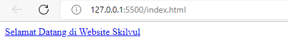
  - #### **Tag untuk membuat daftar list**
    - Unodered List
      ```html
      <!-- Unordered List -->
      <ul>
        <li>Belajar Html</li>
        <li>Belajar Css</li>
        <li>Belajar Javasicpt</li>
      </ul>
      ```
      Hasil di Web Browser:
      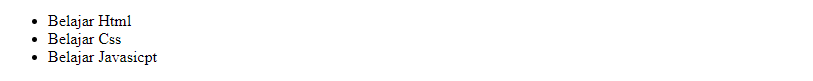
    - Ordered List
      ```html
      <!-- Ordered List -->
      <ol>
        <li>Kucing</li>
        <li>Anjing</li>
        <li>Ikan</li>
      </ol>
      ```
      Hasil di Web Browser:
      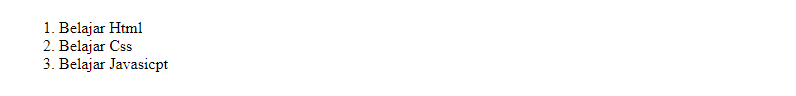
  - #### **Tag untuk membuat daftar list**
    ```html
    
    ```
    Hasil di Web Browser:
    
- ### **Semantic Html**
  <div align="justify">Semantic HTML yaitu menggunakan elemen HTML sesuai dengan kebutuhan konten. Contoh yaitu header, footer, nav, section, aside, dll.

  ```html
  <body>

  <header>
    <h1>My Blog</h1>
  </header>

  <nav>
    <a href="#">Home</a> |
    <a href="#">About</a> |
    <a href="#">Contact</a>
  </nav>

  <article>
    <h1>Welcome To My Blog!</h1>
    <p>Perkenalkan nama saya Arif Setiawan. Biasa dipanggil Arif. Saat ini aku tenggah mengikuti Studi Independen Program Skilvul Tech4Impact: Back-end Web Development. 
    </p>
  </article>

  <footer>
    Copyright &copy; 2022 by Arif Setiawan
  </footer>

  </body>
  ```

- ### **Deploy Website**
  Deploy adalah sebuah proses untuk menyebarkan aplikasi yang sudah kita kerjakan supaya bisa digunakan oleh orang-orang. Jika aplikasi kita HTML atau Web App kita perlu mendeploy ke server. Untuk melakukan hal tersebut kita bisa menggunakan layanan yang bernama Netlify

## **Css**<hr>
- ### **Pengertian & Fungsi Css**
  <div align="justify">CSS adalah bahasa yang digunakan untuk mendesain halaman website.Dengan CSS, kita bisa mengubah warna, menggunakan font custom, editing text format, mengatur tata letak, dan lainnya.

- ### **Cara Penggunaan Css**
  - #### **Inline CSS**
    <div align="justify">
    Inline CSS adalah cara kita memberikan attribute style kepada sebuah element dengan menyisipkannya langsung di dalam element HTML tersebut.

    ```css
    <!DOCTYPE html>
    <html>
      <head>
        <title>
          Selamat Datang
        </title>
      </head>
      <body>
        <h1 style="color:blue;">Belajar Css Dasar</h1>
      </body>
    </html>
    ```
  - #### **Internal CSS**
    <div align="justify">

    Kita menggunakan element/tag `<style>` untuk menyisipkan kode CSS. element/tag `<style>` diletakkan di dalam element `<head>`.

    ```css
    !DOCTYPE html>
    <html>
      <head>
        <title>Selamat Datang</title>
        <style>
          body {
            background-color: yellow;
          }
          h1 {
            color: blue;
          }
          p {
            color: red;
          }
        </style>
      </head>
      <body>
        <h1>Website Pertamaku</h1>
        <p>Saya Masih Pemula</p>
      </body>
    </html>
    ```
  
  - #### **External CSS**
    <div align="justify">

    External CSS adalah cara menyisipkan kode CSS dengan cara membuat file CSS terpisah, dan lalu menyambungkannya dengan file HTML dengan menggunakan element `<link>`. Element `<link>` tersebut diletakkan di dalam element `<head>`.

    Contoh:
    memiliki dua file: index.html untuk file HTML-nya dan styles.css untuk file CSS-nya.

    ```css
    <!-- File index.html -->
    <!DOCTYPE html>
    <html>
      <head>
        <title>Selamat Datang</title>
        <link rel="stylesheet" href="styles.css" />
      </head>
      <body>
        <h1>Website Pertamaku</h1>
        <p>Saya Masih Pemula</p>
      </body>
    </html>
    ```
    ```css
    /* File styles.css */
    body {
      background-color: pink;
    }
    h1 {
      color: blue;
    }
    p {
      color: black;
    }
    ```
- ### **Css Syntax**
  <div align="justify">
  
  CSS Syntax adalah syntax yang digunakan untuk menunjuk atau memilih HTML element mana yang ingin diberi style (dihias). CSS syntax terdiri dari selector, property, dan value. Contohnya kita memiliki element heading satu `<h1>` yang ingin kita ubah menjadi warna merah.
  ```css
  h1 {
    color: blue;
  }
  ```
- ### **Access file .css**
  ```html
  <!-- Jika file css sejajar dengan file Html -->
  <link rel="stylesheet" type="text/css" href="style.css"> 
  <!-- Jika file css berada didalam folder yang sejajar dengan file Html -->
  <link rel="stylesheet" type="text/css" href="css/style.css">
  <!-- Jika Html berada didalam folder, Css sejajar dengan folder Html -->
  <link rel="stylesheet" type="text/css" href="../style.css">
  ```
- ### **CSS - Tag Name**
  <div align="justify">Kita bisa menggunakan Tag Elemen HTML secara langsung pada CSS.Jika menggunakan Tag Element, maka ini bersifat global.

  ```html
  <!-- File Html -->
  <body>
  <div>
    <h1>Selamat Datang Di Blog Saya</h1>
    <P>Saya Masih Pemula</P>
  </div>
  <div>
    <h1>My Profile</h1>
    <ol>
      <li>Nama : Arif Setiawan</li>
      <li>Umur : 22 Tahun</li>
      <li>Kampus : Universitas Merdeka Madiun</li>
      <li>Alamat : Ngawi, Jawa Timur</li>
    </ol>
  </div>
  <div>My Gallery</div>
    
  </body>
  </html>
  ```

  ```css
  <!-- File Css -->
  h1 {
    color : aqua;
  }
  ```
  Hasil di Web Browser

  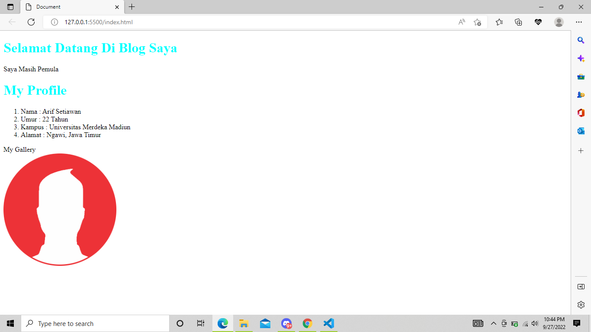

  Dari contoh gambar diatas Tag Element `<h1>` yang ada di file Html akan ikut berubah semua.

- ### **CSS Class Name**
  <div align="justify">
  Cara menggunakan attribute class pada elemen HTML yaitu dengan cara memanggil nama class tersebut pada file CSS

  ```html
  <!-- File Html -->
  <h1 class="title">My Profile</h1>
  ```

  ```css
  <!-- File Css -->
  .title {
    color : aqua;
  }
  ```
- ### **CSS - ID Name**
  <div align="justify">
  Berbeda dengan Class Name. ID Name bersifat unik artinya hanya ada 1 nama ID pada 1 element HTML.

  ```html
  <!-- File Html -->
  <p id="paragrafSatu">Namaku Arif</p>
  ```
  ```css
  <!-- File Css -->
  #paragrafSatu {
    border: solid red;
  }
  ```

- ### **Flexbox**
  <div align="justify">Flexbox memudahkan para programmer untuk mengatur layout, posisi, dan ukuran dari tiap element di dalamnya.Ada dua istilah penting saat belajar flexbox:

  - *container* adalah element yang membungkus dan mengatur tampilan dari element di dalamnya.
  - *item* adalah element dalam container yang diatur tampilannya.<hr>
  - **Justify - content** digunakan untuk mengatur tata letak antar item child secara horizontal.
  - **Align - content** digunakan untuk mengatur tata letak antar item child secara vertikal atau cross axis.
  - **Flex-grow** digunakan untuk mengatur size suatu item child pada flexbox.
  - **Flex-shrink** digunakan untuk memperkecil size suatu item child secara relatif terhadap item child lainnya.
  - **Flex-basis** digunakan untuk mengatur width setiap item child.

- ### **Hasil Belajar Styling Css**  
  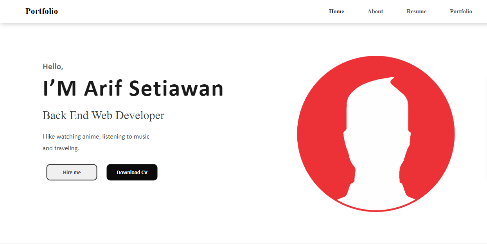

## **Algoritma**<hr>
- ### **Pengertian Algoritma & Struktur Data**
  <div align="justify">

  *Algoritma* adalah sederetan langkah-langkah logis yang disusun secara sistematis untuk memecahkan suatu masalah. Sedangkan *Struktur data* adalah cara penyimpanan , pengorganisasian , dan pengaturan data di dalam media penyimpanan komputer sehingga data tersebut dapat digunakan secara efisien.

- ### **Mengapa kita harus belajar Algoritma?**
  <div align="justify">
  Algoritma diperlukan untuk menulis sebuah program agar hasilnya sesuai harapan. Tanpa adanya algoritma, Kita tidak akan tahu apakah program yang dibuat sudah sesuai harapan dan apakah program yang dibuat benar-benar memecahkan sebuah masalah. Cara terbaik agar kita belajar pemrograman adalah menerapkan algoritma yang telah dibuat sebelumnya. Sehingga algoritma dapat menjadi dasar sebelum pemrograman.

- ### **Kualitas wajib dari Algoritma**
  <div align="justify">

  - Input dan output harus didefinisikan terlebih dahulu dengan tepat
  - Setiap step harus benar-benar clear dan tidak ambigu
  - Algoritma seharusnya tidak mengandung suatu code pada bahasa pemograman tertentu. Algoritma harus dibuat agar dapat digunakan dalam bahasa pemograman apapun.

- ### **Pseudocode**
  <div align="justify">
  Pseudocode adalah menuliskan algoritma dengan umumnya bahasa inggris sebelum kita implementasikan ke bahasa pemograman tertentu.

  - #### **Panduan menulis pseudocode**
    - Huruf kapital digunakan untuk menulis perintah
    - 1 statement hanya terdiri dari 1 baris
    - Menggunakan indentasi
    - Harus bersifat spesifik dan simple

    Contoh :
    ```
    input 1 = 5
    input 2 = 10
    output = input 1 +input 2
    print ("Result", output) 
    ```
  - #### **Conditional**
    <div align="justify">
    Conditional digunakan saat dibutuhkan percabangan kasus. Komputer akan melakukan suatu tindakan jika suatu kondisi terpenuhi.

    ```
    If "Lapar"
    Do "Makan"

    Display "Saya jadi kenyang"
    ```
  - #### **Looping**
    <div align="justify">
    Komputer dapat melakukan sebuah proses yang sama berulang-ulang.Jika membutuhkan perulangan dalam kasus tertentu, kita bisa menggunakan Looping.

    ```
    i = 1
    for (i, 1<=5 , i++){
      print i
    }
    ```
  - #### **Contoh Penerapan Salah Satu Struktur Data  Array Dengan Javascript**

    ```javascript
    let kelas = ["html", "css", "javasricpt"];
    let a;

    for(a = 2; 0 <= a; a--){
    console.log("aku belajar " + kelas[a]);
    }
    ```
## **Javasricpt**<hr>
   - ### **Deskripsi Javasricpt**
     <div align="justify">

     - JavaScript merupakan bahasa pemrograman yang digunakan untuk membuat web menjadi lebih interaktif dan responsive. 
     - Javascript adalah bahasa pemograman yang sangat powerful yang digunakan untuk logic pada sebuah website
     - Untuk menjalankan javascript pada umumnya menggunakan web browser seperti Chrome, Microsoft Edge, Mozila Firefox, kalau pakai code editor Visual Studio Code bisa di bagian console.

  -  ### **Tipe Data di JavaScript**
     - **String** - deretan karakter yang diapit oleh sepasang tanda kutip .

       ```JavaScript
       let name = "Arif Setiawan";
       ```
     - **Number** - bilangan bulat, pecahan, dan lain-lain;

       ```JavaScript
       let umur = 22;
       ```
     - **Boolean** - nilai benar dari sebuah pernyataan yang dituliskan sebagai true atau false;

       ```JavaScript
       let sayang = true;
       let benci = false;
       ```
     - **Null** - sebuah nilai yang berarti kosong atau menunjuk pada nilai yang tidak ada;
       ```JavaScript
       let learning = "Belajar Javascript"
       console.log(learning); //undefined
       ```
     - **Undefined** - berbeda dari null, undefined menandakan kondisi variabel yang belum diberi sebuah nilai. Jadi pernyataan "nilai variabel itu adalah undefined" sebenarnya kurang tepat, sebab variabelnya memang tidak mempunyai sebuah nilai;

       ```JavaScript
       let learning = "Belajar Javascript"
       console.log(learning); //undefined
       ```
     - **Object**- sebuah kumpulan pasangan properti dan nilai. Seperti objek dalam kehidupan sehari-hari saja. Misalnya objek Apel memiliki properti warna dengan nilai merah

       ```JavaScript
       let manusia = {
       nama : "Arif",
       alamat : "Ngawi",
       umur : 30,
       };
       ```
     
   -  ### **Operator Javascript** 
      - **Assignment Operator (=)**
        Assignment operator digunakan untuk menyimpan sebuah nilai pada variabel.

        ```JavaScript
        let bilangan = 10;
        bilangan += 5;

        console.log(bilangan); // Output: 15
        ```
      
      - **Increment dan Decrement**
        
        Gunakan increment atau decrement untuk menambah atau mengurangi sebesar 1 nilai.

        ```JavaScript
        let bilangan = 5;
        bilangan++ ;

        console.log(bilangan); // Output: 6
        ```
      
      - **Arithmetic Operator**
        
        Arithmetic operator adalah operator yang melibatkan operasi matematika.
        - Tambah (+)
        - Kuramg (-)
        - Perkalian (*)
        - Pembagian (/)
        - Modulus (%)

        ```Javascript
        console.log(3+4); // 7
        console.log(8-4); // 4
        console.log(3*4); // 12
        console.log(8/4); // 2
        console.log(8%2); // 0
        ```

      - **Comparison Operator**
        - Comparison operator adalah operator yang membandingkan satu nilai dengan nilai lainnya.
        - Hasil operasi yang melibatkan comparison operator adalah antara true or false
        
        ```Javascript
        8 < 10 //Menghasilkan False
        8 > 10 //Menghasilkan True
        ```
       - **Logical Operator**
         
         Logical operator biasa digunakan untuk sebuah CONDITIONAL pada pemograman.Menghasilkan nilai BOOLEAN yaitu TRUE or FALSE.
         - AND operator : &&
         - OR operator: ||
         - NOT operator: !
    
  - ### **Conditional**
     <div align="justify">
     merupakan statement percabangan yang menggambarkan suatu kondisi, statement akan mengecek kondisi spesifik dan menjalankan perintah berdasarkan kondisi tersebut. Yang dicek adalah apakah kondisi tersebut TRUE (benar). Jika TRUE maka code didalam kondisi tersebut dijalankan. Kondisi tersebut bisa menggunakan  
     
     ``IF, IF.. Else, IF.. Else if Statement``.

     ```Javascript
     function ganjilGenap(platNomor) {
     // Tulis kode kalian di dalam fungsi ini
     if (platNomor % 2 == 1) {
        return ("ganjil")
        }
        else { return("genap")
        }
    ```
}

  - ### **Looping**
    <div align="justify">
    adalah statement yang mengulang atau perulangan sebuah instruksi hingga kondisi terpenuhi atau jika kondisi stop atau berhenti tercapai. Misal menggunakan perulangan 
    
    ``For Loop`` contoh statement
     
    ```JavaScript
        for(let a = 1; a <= 10; a++){
        console.log(a); // 1 2 3 4 5 6 7 8 9 10
        } 
    ```


  

  
    


 


  
  


  

  

  


  


