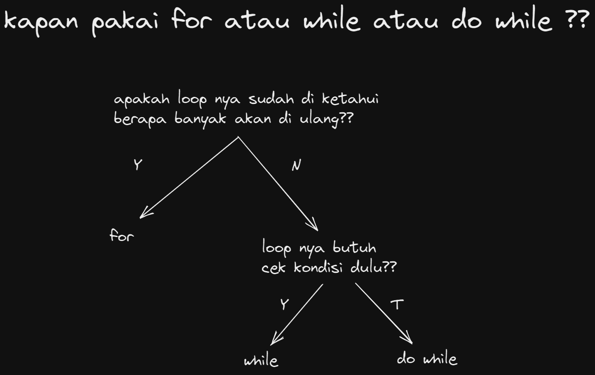
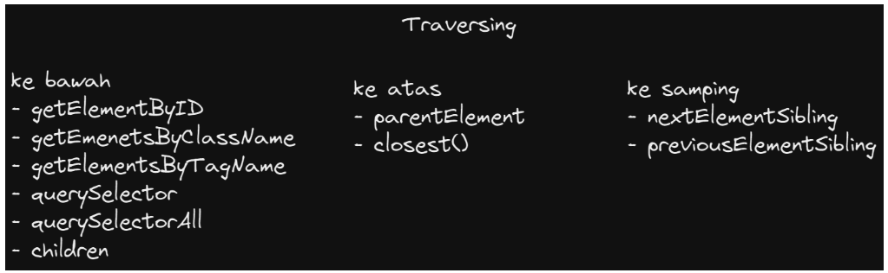

# <center>**Writing & Presentation Week 2**

## **JavaScript Looping**<hr>
- ### **Deskripsi Loop**
  <div align="justify">
  Looping merupakan statement yang mengulang suatu instruksi hingga kondisi terpenuhi atau jika kondisi stop atau berhenti.<br>

  - Contoh macam Loop :
    - For Loop
    - While Loop
    - Do While Loop

  - Gambaran kapan kita harus menggunakan dari 3 macam Loop diatas.

    

- ### **For Loop**
  <div align="justify">
  digunakan jika kita tahu pasti seberapa banyak pengulangan yang ingin dilakukan pada program yang akan dikembangkan<br>
  contohnya :

  ```javascript
  for (let i = 1; i <= 10 ; i++) {
  console.log(i) //1,2,3,4,5,6,7,8,9,10
  }
  ```
  Pembahasan :<br>
  <div align="justify">
  
  `i` memilki nilai 1, lalu kondisi `i` lebih kecil sama dengan 10, maka `i` ditambah 1 jadi 2. Lalu kasus pertama `True` maka ditampilkan nilai `i` tersebut yaitu 1. Lanjut `i` jadi 2 karena ditambah nilai nya, nilai `i` lebih kecil sama dengan 10, maka True terus ditambah 1 jadi 3. Proses terus berlanjut dan berhenti sampai nilai `i` lebih dari 10 dan akan bernilai false.
- ### **While Loop**
  <div align="justify">
  While Loop akan menjalankan instruksi pengulangan bernilai TRUE Ada 2 macam while loop yaitu while dan do while<br>
  contoh perulangan while :

  ```javascript
    let i = 1
    let isKetemu = false

    while (!isKetemu) {
      if (
        i % 2 == 0 && 
        i % 3 == 0 && 
        i % 4 == 0 && 
        i % 5 == 0 &&
        i % 6 == 0 
        ) {
          console.log(i);
          isKetemu = true
        }
          i++
    } 
  ```

  Pembahasan :
  <div align="justify">

  Variable `i` memiliki nilai 1 dan variable `isKetemu` nilai `False`. Selama `(!isKetemu)` berarti kebalikan dari nilai `False` yaitu `True`. Sekarang nilai `isKetemu` jadi `True`. Lanjut ke `IF`, jika `i % 2 == 0`, `i` akan mencari nilai yang bisa dibagi nilai 2 yang memiliki hasil 0, dan selanjutnya sampai ke `i % 6 == 0` dan selanjutnya semua `True` maka ditampilkan nilai `i` yaitu output `60`.

- ### **Do While Loop**
  <div align="justify">
  Menjalankan pengulangan 1 kali sebelum dilakukan pengecekan kondisi

  ```javascript
    let  i = 1
    let isKetemu = false;

        do {
          if (
            i % 2 == 0 && 
            i % 3 == 0 && 
            i % 4 == 0 && 
            i % 5 == 0 &&
            i % 6 == 0 
            ) {
               console.log(i);
               isKetemu = true
            }

                i++
        } while (!isKetemu)
  ```

  Pembahasan :
  <div align="justify">

  Memiliki proses cara kerja kasus yang sama dengan `While`. Tapi ada perbedaan di proses sama kondisi di akhir. Jika saat variable `i` yaitu 1 maka tidak bisa dibagi 2, lalu `i` tambah 1 sampai jadi `i = 10` dan bisa `% 2 == 0`, maka nilai `i = 10` dan lanjut ke statement selanjutnya `% 3 == 0` sampai ke nilai yang bisa dapat `% 6 == 0`. Jadi nilai semua yang awalnya false menjadi `true` karena nilai sudah ketemu dan ditampilkan. Lalu kondisi `While` memastikan `(!isKetemu)` bahwa benar varibel telah berubah dari kebalikan `false` yang di deklarasi di atas.
## **JavaScript Scope dan Function**<hr>
- ### **Scope**
  <div align="justify">
  adalah konsep dalam flow data variabel. Menentukan suatu variabel bisa diakses pada scope tertentu atau tidak.

- ### **Blocks**
  <div align="justify">
  Blocks adalah code yang berada didalam curly braces {}. Conditional, function, dan  looping menggunakan blocks.

- ### **Global Scope**
  <div align="justify">
  Global scope berarti variabel yang kita buat dapat diakses dimanapun dalam suatu file.Agar menjadi Global Scope, suatu variabel harus dideklarasikan diluar Blocks.<br>
  Contoh Global Scope :
 
  ```javascript
  let myName = "Arif" ; 
  function greeting()
     return myName;
  {
     console.log(myName);
  ```

- ### **Local Scope**
  <div align="justify">
  Local scope berarti kita mendeklarasikan variabel didalam blocks seperti function, conditional, dan looping.Maka variabel hanya bisa diakses didalam blocks saja. Tidak bisa diakses diluar blocks.<br>
  Contoh Local Scope :

    ```javascript
    function greetting(){
        let myName = "Arif";
        return myName;
    }
    console.log(gretting())
    console.log(myName);
    ```

- ### **Function**
    <div align="justify">Function adalah sebuah code blok dalam sebuah grup untuk menyelesaikan 1 task.<br>
    
    *Cara memanggil function :*
    ```javascript
    myFunction()
    console.log(myFunction());
    ```

    *Cara membuat function ada 3 :*
    - **Function Clasic**
        ```javascript
        function myFunction(kondisi) { }
        ```
    - **Function Variable**
        ```javascript
        let myFunction = function (kondisi) { }
        ```
    - **Arrow Function**
        ```javascript
        let myFunction = (kondisi) => { }
        ```

- ### **Parameter Function**
    - <div align="justify">
      Dengan parameter, function dapat menerima sebuah inputan data dan menggunakannya untuk melakukan task/tugas.
    - <div align="justify">
      Saat membuat function/fitur, kita harus tahu data-data yang dibutuhkan. Misalnya saat membuat function penambahan 2 buah nilai. Data yang dibutuhkan adalah 2 buah nilai tersebut.

      ```javascript
      function penambahan (a,b){ // (a,b) merupakan parameter
          return a + b;
      }
      ```


- ### **Argumen Function**
    - <div align="justify">
      Argumen adalah nilai yang digunakan saat memanggil function.
    - <div align="justify">
      Jumlah argumen harus sama dengan jumlah parameternya

      ```javascript
      function penambahan (a,b){ // (a,b) merupakan parameter
          return a + b;
      }
      console.log(penambahan(5,5)) // (5,5) adalah argumen
      ```
- ### **Menggunakan Arrow Function**
  <div align="justify">
  Di Javascript ES6, ada cara baru dalam penulisan sebuah fungsi, yaitu menggunakan arrow function. Kelebihan menggunakan arrow function adalah penulisan fungsi menjadi lebih singkat dan lebih mudah dibaca.

     ```javascript
     let penambahan = (a, b) => {
     let hasil =  a + b;
     return hasil;
     };

     console.log(penambahan(3, 4)); // Output: 7
     ```

## **JavaScript Prototype and Method**<hr>
- ### **Properties** 
  <div align="justify">
  Yaitu nilai yang berkaitan dengan objek pada JavaScript.Properties biasanya dapat diubah, ditambahkan, dan dihapus, tetapi beberapa hanya dapat dibaca.
- ### **Method JavaScript**
  <div align="justify"> 
  adalah properti yang berisi definisi fungsi. Metohd adalah fungsi yang disimpan sebagai properti objek

- ### **Data Type**
  <div align="justify">  
  JavaScript memiliki 2 jenis tipe data :

  - **Type Data Primitive**
    - *string* - deretan karakter yang diapit oleh sepasang tanda kutip;
    - *number* - bilangan bulat, pecahan, dan lain-lain;
    - *boolean* - nilai benar dari sebuah pernyataan yang dituliskan sebagai true atau false;
    - *null* - sebuah nilai yang berarti kosong atau menunjuk pada nilai yang tidak ada;
    - *undefined* - berbeda dari null, undefined menandakan kondisi variabel yang belum diberi sebuah nilai. 

  - **Type Data Non-Primitive**
    - *object* - sebuah kumpulan pasangan properti dan nilai. Seperti objek dalam kehidupan sehari-hari saja. Misalnya objek Apel memiliki properti warna dengan nilai merah.

    <br>

- ### **String JavaScript**
    <div align="justify">

    Tipe data yang terdiri dari kumpulan karakter yang berurutan. Ditulis dalam tanda kutip tunggal atau ganda `(' ')/(" ")`.
    - Contoh
      ```javascript
      let name = "Arif";
      ```
-  ### **Penggunaan Properties** 
    - Mengecek jumlah karakter
        ```javascript
        console.log(hewan.length);
        ```
- ### **Penggunaan Method**
    - Mengecek tipe data yang di gunakan
        ```javascript
        let hewan = "kAnCIl"
        console.log(typeof hewan) // string
        ```
    - Merubah huruf menjadi huruf besar
        ```javascript
        console.log(hewan.toUpperCase())
        ```
    - Merubah huruf menjadi huruf kecil
        ```javascript
        console.log(hewan.toLowerCase())
        ```
    - Mengembalikan karakter sesuai index yang sudah di tentukan
        ```javascript
        console.log(hewan.charAt(1))
        ```
    - mencari sebuah kata atau karakter pada sebuah string
        ```javascript
        console.log(hewan.includes("s")) // true
        ```

    - Memisahkan sebuah string menjadi data array dengan split()
        ```javascript
        let kalimat = "Belajar menggunakan Method Split()"

        console.log("AFTER", kalimat.split(" "));
        ```
- ### **Number JavaScript**
    <div align="justify">Number merupakan tipe data yang digunakan untuk menunjukan angka, baik positif maupun negatif. Number juga merupakan tipe data yang digunakan untuk menunjukan notasi matematika.
    
    <br>

    - #### **Penggunaan Method dan properties pada Number**
        - Mengecek not number (bukan angka)
            ```javascript
            console.log(isNaN(2131)) // false
            console.log(isNaN("dawdf")) // true
            console.log(isNaN(true)) // false karena true == 1
            ```
        - Merubah angka menjadi Number
            ```javascript
            let angka = 20
            cosnloe,log(angka.toString) // "20"
            ```
        - menentukan jumlah angka di belakang koma(,)
            ```javascript
            let angka = 3.12345
            console.log(angka.toFixed(1)) // 3.1
            console.log(angka.toFixed(2)) // 3.12
            ```

- ### **Math JavaScript**
    <div align="justify">
    Math adalah objek yang  telah di sediakan oleh javascript dengan math ini kita bisa bermain menolah data. 
    
    - #### **Math memiliki berbagai macam properties**<br> 
       Contoh :
        ```javascript
        console.log(Math.PI) // 3.141592653589793
        console.log(Math.LOG2E) // 1.4426950408889634
        ```
    - Method pada math
        - mengembalikan nilai bulat
            ```javascript
            console.log(Math.abs(-5)) // 5
            ```
        - mencari nilai hasil perpangkatan
            ```javascript
            console.log(Math.pow(3,2)) // 9
            ```
        - Mencari akar dari sebuah nilai
            ```javascript
            console.log(Math.sqrt(9)) // 3
            ```
        - Membulatkan angka
            ```javascript
            console.log(Math.round(123.123)) // 123
            ```
        - Membulatkan angka kebawah
            ```javascript
            console.log(Math.floor(20.5)) // 20
            ```
        - Membulatkan angka ke atas
            ```javascript
            console.log(Math.ceil(20.5)) // 21
            ```
## **JavaScript DOM Manipulation**<hr>
- ### **Deskripsi DOM**
  <div align="justify">
  DOM merupakan jembaatan supaya bahasa pemrograman dapat berinteraksi dengan dokumen HTML. Dengan DOM, Javascript dapat memanipulasi HTML.<br>
  Gambar ilustrasi :

  
- ### **DOM - Traversing Elemets**
  Yaitu cara menelusuri atau menjelajahi elemen - elemen menggunakan DOM. <br>
  Cara akses Traversing di bagi menjadi 3 yaitu :
  
    ``
    - ### **Contoh File index.html**
      ```html
      <body>
        <h1 id="title">Hallo</h1>

        <ul class="list">
           <li class="item">satu</li>
           <li class="item">dua</li>
           <li class="item">tiga</li>
        </ul>

      <div class="hewan">
        <ul class="mamalia">
          <li>kucing</li>
          <li>kelinci</li>
          <li>kambing</li>
        </ul>
        <ul class="reptil">
          <li>kadal</li>
          <li>ular</li>
          <li>buaya</li>
        </ul>
        <ul class="unggas">
          <li>ayam</li>
          <li>bebek</li>
          <li>burung</li>
        </ul>
      </div>
          <script src="./script.js"></script>
      </body>
      ```


    
    - ### **Traversing kategori Ke Bawah**
        - **getElementById**
            <div align="justify">Mengembalikan data dalam bentuk kumpulan dari elemen berdasakan nama ID nya

            ```javascript
            let title = document.getElementById("title")
            console.log(title) // <h1 id="title">Hallo</h1>
            ```
            
        - **getElementsByClassName**
            <div align="justify">Mengembalikan data dalam bentuk kumpulan dari elemen berdasakan nama class nya

            ```javascript
            let items = document.getElementsByClassName("item")
            console.log(items[2]); // <li class="item">tiga</li>
            ```

        - **getElementsByTagName**
            <div align="justify">Mencari Element berdasarkan nama tag nya

            ```javascript
            let itemByTag = document.getElementsByTagName("li")
            console.log(itemByTag[1])
            console.log(itemByTag.item(1))
            console.log(itemByTag.length)
            ```
        - **querySelector**
            ```javascript
            let listQuery = document.querySelector(".list")
            console.log(listQuery);
            ```
        - **querySelectorAll**
            ```javascript
            let itemQueryAll = document.querySelectorAll(".item")
            console.log(itemQueryAll)

            let itemQueryAll = document.querySelectorAll(".item")
            console.log(itemQueryAll) // mendapatkan data dalam bentuk node list
            ```

        <br>

    - ### **Traversing ke atas**
        -  **parentElement**

            ```javascript
            console.log(itemQuery.parentElement); // <ul class="list">...</ul>
            ```
        -  **closest**

            ```javascript
            console.log(itemQuery.closest(".list"));
            ```
    
    - ### **Traversing ke Samping**
        <div align="justify">Akses sibling atau saudaranya (sebelum atau sesudah elementnya)
        
        - **previousElementSibling**

            ```javascript
            console.log(itemQuery.previousElementSiblingc);
            ```
        - **nextElementSibling**
            ```javascript
            console.log(itemQuery.nextElementSibling);
 
            ```
- ### **DOM Event**  
  <div align="justify">         
  Event dalam DOM yang digunakan untuk membuat object model yang betugas untuk membantu interaksi user dengan document HTML, <br>
  contoh sebagai berikut :

  - **Click**
    ```javascript
    paragraf.onclick = function () {
      alert("ini dari paragraf")
    }
    ```
  - **Submit**
    ```javascript
    loginForm.addEventListener("submit", (event) => { 
    event.preventDefault()
      }
    ```
  - **Focus**
    ```javascript
    object.addEventListener("focus", myScript);
    ```
  - **Blur**
    ```javascript
    object.addEventListener("blur", myScript);
    ```
  - **Hover**
    ```javascript
    object.addEventListener("mouseover", myScript);
    ```
  - **Change**
    ```javascript
    object.addEventListener("change", myScript);
    ```
  - **Scroll**
    ```javascript
    object.addEventListener("scroll", myScript);
    ```

  


    


